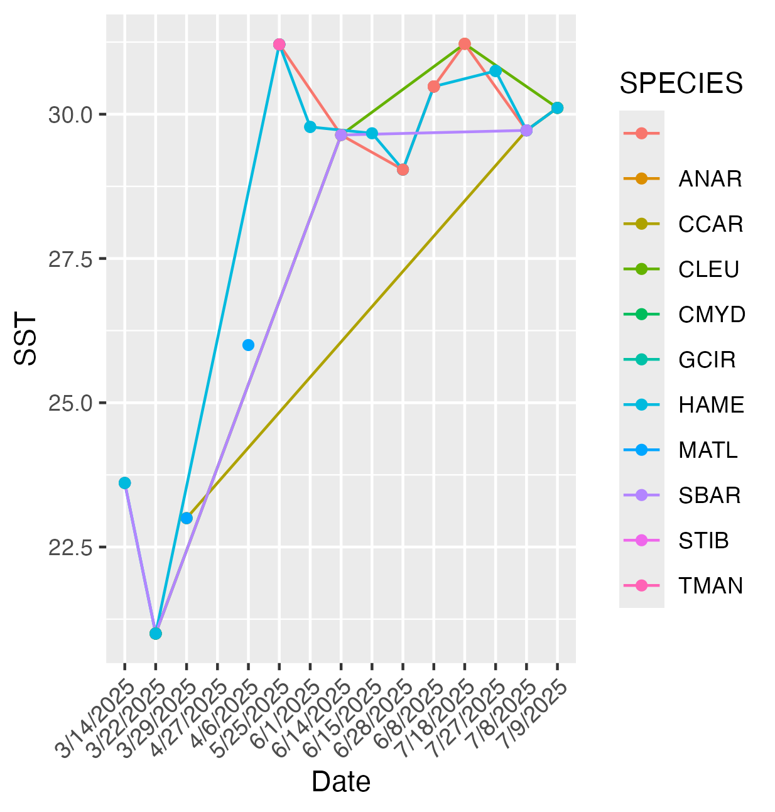
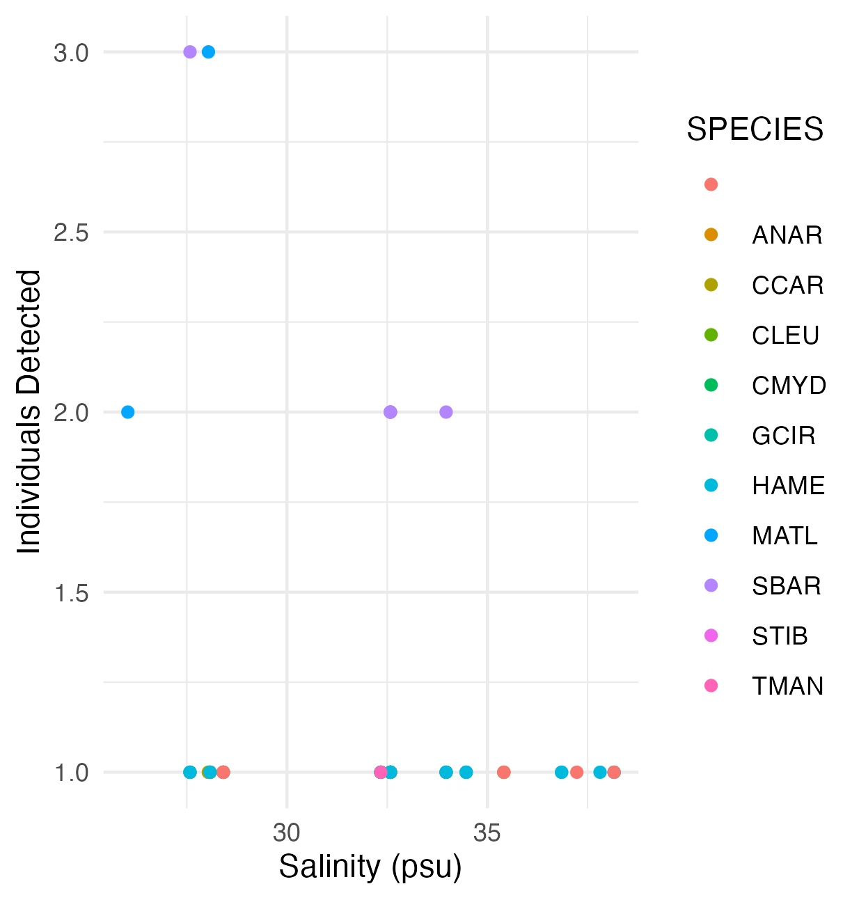
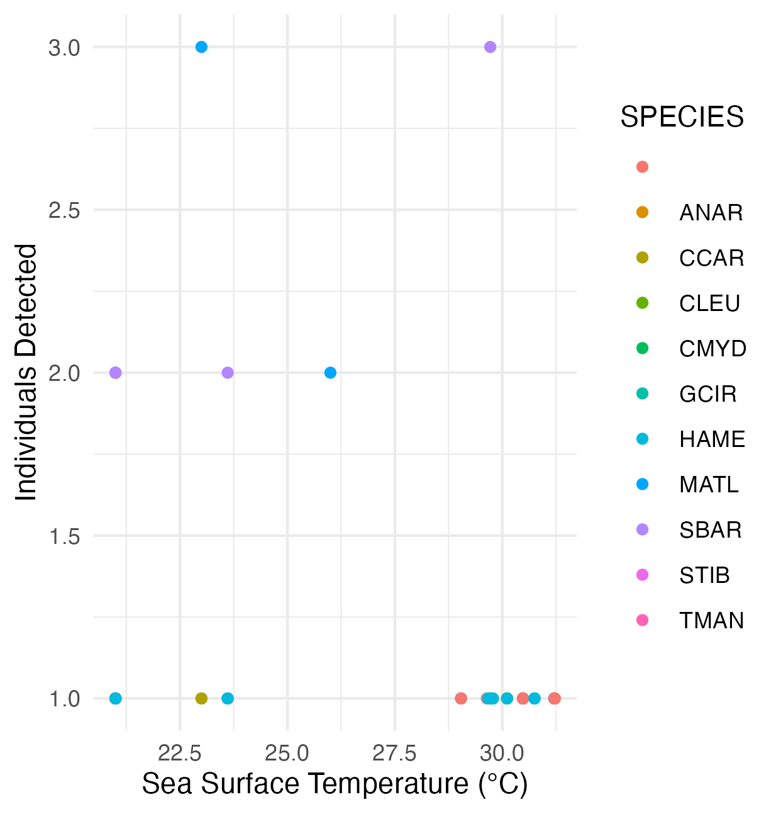
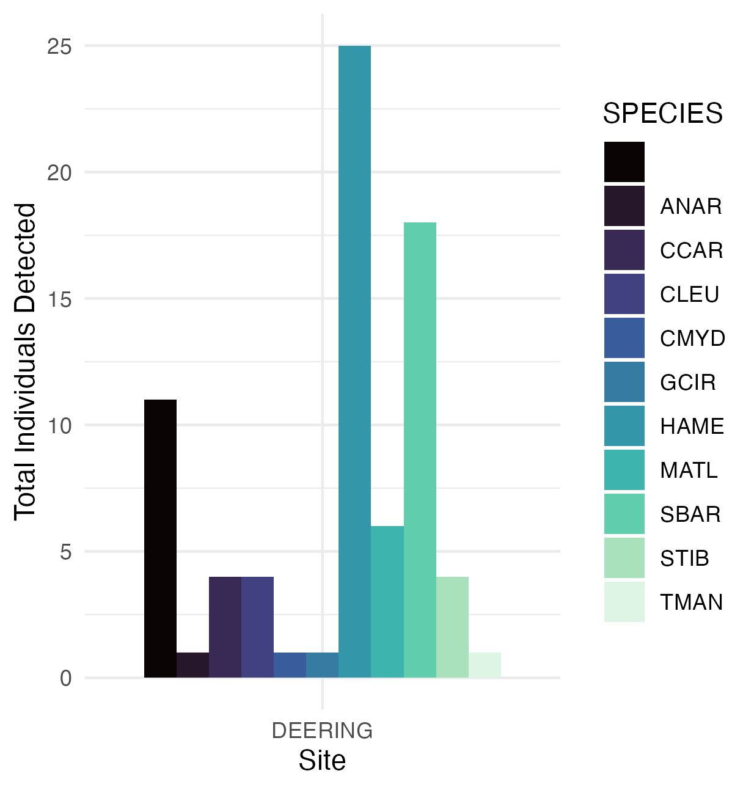

# Portfolio
My portfolio

## Description

The objective of my project is to use data I have collected from drone 
surveys and analyze for any trends in biodiversity or relative abundance of marine 
megafauna. I have data sets containing environmental parameters and species 
detections. I will wrangle and clean this data to see if different environmental
factors influence species detections. 

## Repository Structure
Three main folders within the repository:

- `data/`:
  - `data/raw`: contains two `*.csv` files downloaded from google sheets
  -`data/processed`: contains the cleaned version of my data
  -`data/output`: contains the data that is ready to be exported
- `scripts/`: R scripts for analysis
  - `scripts/01_processing`: contains one script that cleans, processes, and exports data
  - `scripts/02_analysis`:
  - `scripts/03_content`: 
- `results/`: contains figures 

## About the data
### Column names of clean data
- `date`  - Numeric
- `site_x` - Character - Options are "Deering" and "Crandon"
- `number_individuals` - Numeric
- `lifestage` - Character - Options are "Unknown", "Adult", "Juvenile" and "Subadult"
- `am_low` - Numeric
- `pm_low` - Numeric
- `sst_c` - Numeric
- `salinity_psu` - Numeric
- `o2` - Numeric
- `sea_state` - Numeric
- `x_people_pd` - Numeric
- `fishing_bb` - Numeric
- `glare` - Character - Options are "Poor", "Fair", and "Good"
- `transect_id` - Numeric
- `species` - Character - Options are species code from scientific name "TMAN",
"CMYD","CCAR","PPEC","DSAB","HAME","UJAM","SMOK","SLEW","GCIR","NBRE","CLIM",
"CLEU","CACR","GCUV","STIB","SBAR","ANAR","MATL","NA","UNIDT"
- `transect_start_time` - Numeric
- `weekend_or_weekday` - Character - Options are "Weekend", "Weekday", and "Holiday"
- `am_high` - Numeric
- `pm_high` - Numeric
- `wind_mph` - Numeric
- `o2_ppm` - Numeric
- `cl_con_ug_1` - Numeric
- `fishing_cp` - Numeric
- `fishing_pd` - Numeric
- `fishing_dp` - Numeric
- `cloud_cover`- Numeric - Options are "0-25%", "26-50%","51-75", "76-100"

## Results

## Author

[Kimberly Heely]
